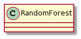

# Random Forests


The goal of this project is to implement in Python a random forest for classification, regression and outlier detection. The focus, however, is on two aspects:
- object-oriented design, according to OO principles and patterns
- good programming practices: logging, comments and coding style 

This project was the practicum of the Object Oriented Programming course of the Matemàtiques Computacionals i Anàlisi de Dades (Mad-CAD) degree at Universitat Autònoma de Barcelona, 2021-22.

## Requirements

- Python 3.x
- Numpy
- Matplotlib

## Usage

Follows scikit-learn style

```python
rf = RandomForestClassifier(
        max_depth,    # of each decision tree
        min_size,     # of a node to make it a leave
        ratio_sample, # to get the size of the dataset when looking for the best split
        n_trees,      # number of trees in the forest
        n_features,   # number of features (randomly selected) to consider when looking for the best split 
        criterion     # either Gini or Entropy              
)
rf.fit(Xtrain, ytrain)
ypred = rf.predict(Xtest)
# and same for regression
rf = RandomForestRegressor(...)
```

## Design
(put here your final design)



## Authors

This is team work with Pere Garriga and Genis Soler.

<!---
maybe link to their Github accounts 
-->


